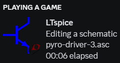

# Rich presence for LTspice



## Install and run

Install dependencies:

```powershell
.\install.ps1
```

Run with:

```powershell
.\run.ps1
```

Create a shortcut in `shell:startup` to start listening on startup:

Target: `C:\Windows\System32\WindowsPowerShell\v1.0\powershell.exe -Command [PATH]\ltspice-discord\run.ps1`\
Start in: `[PATH]\ltspice-discord\`

## How does it work

This script extracts file type from the title of any LTspice application then uses it to update the status on Discord.

The code should be short enough to audit if you are worried about data exfiltration, etc.

## Icons

Icons adapted from:

https://commons.wikimedia.org/wiki/File:BJT_NPN_symbol-fr.svg

https://en.wikipedia.org/wiki/File:Oscillation_amortie.svg?&useskin=vector

https://commons.wikimedia.org/wiki/File:AND_ANSI.svg
